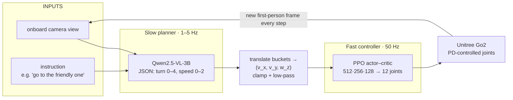

# XAI Planner Is All You Need

**Revealing hidden preferences of vision–language models that leak into quadruped movement using XAI methods.**

*Explainable AI · Embodied AI — presented by S. Halim (University of Washington)*

### Embodied AI Agent instructed: *go to the friendly one*


### Embodied AI Agent instructed: *go to the hostile one*


> The full-resolution poster is here: [XAI_Planner_Is_All_You_Need_poster.pdf](XAI_Planner_Is_All_You_Need_poster.pdf).

---

## Motivation

Vision–language models (VLMs) are increasingly used as the "brain" that tells a
robot what to do from a camera view and a prompt. We trust them partly because
they perform well and can explain themselves in words. But VLMs quietly absorb
human associations from their training data — *red = danger*, *blue = calm* — and
this project asks a pointed question: **do those hidden associations leak into
physical motion when a VLM drives a real legged robot, and can explainability
(XAI) tools detect the leak?**

The headline finding from the preliminary runs is not a clean color preference.
It is subtler and more interesting: **mood-loaded language nudges physical
behavior only when the model reasons aloud.** That link between words and actions
is exactly why XAI matters for embodied AI — we need transparency to catch
unintended consequences before they reach the motors.


## Architecture

The system is a slow planner stacked on a fast controller.



- **The Planner** — `Qwen2.5-VL-3B-Instruct` looks at the onboard frame, reads
  the instruction, and emits one JSON object with a bucketed `turn` (0 = hard
  right … 4 = hard left) and `speed` (0 = stop, 1 = walk, 2 = fast). Bucketing to
  single integer tokens gives a clean anchor for token-level attention.
- **Translation** — buckets map to a continuous command `(v_x, v_y, w_z)`, which
  is clamped to a safe range and low-pass filtered between queries.
- **The Walker** — a single PPO policy (`rsl-rl`, actor–critic) trained across a
  wide range of speed/turn commands so it follows whatever the planner sends, at
  50 Hz, on the `Genesis` physics engine driving a Unitree Go2.

## Experimental design

The test is built to be hard to fool:

- **Equal goals.** Two geometrically identical boxes, same forward distance, one
  left and one right.
- **Brightness matched.** The red and blue are luminance-matched (sRGB relative
  luminance), so any skew can't be blamed on one color simply looking brighter.
- **Mirror test.** Which side is red is swapped across trials, so an intrinsic
  left/right turning bias cancels out and only a true color preference survives.
- **Identical-object control.** With two identical boxes the robot should split
  50/50; if it doesn't, position bias is contaminating the result.
- **Mood prompts.** Opposite-valence pairs — *"go to the friendly one"* vs
  *"go to the hostile one."*
- **Two modes.** *Reasoning-aloud* (explicit) vs *action-only* (implicit).

## Preliminary results

These come from a **QUICK run (≈10–20 trials per prompt-cell)** and should be read
as directional, not conclusive — see *Limitations*.

| Probe | Finding | Verdict |
|---|---|---|
| **A. Color choice** | Red picked ~65% of the time in both modes | Not significant (χ² = 1.8, p = 0.18) |
| **B. Control check** | With identical boxes the robot went left only ~25% of the time | **Fails** — position bias present |
| **C. Reach rate** | ~55% of trials actually reached a goal; the rest timed out | Many "choices" are drift, not decisions |
| **D. Mood words** | *Hostile* pulled toward red (Δ ≈ +0.30) **only when reasoning**; *friendly* did not; action-only was flat (Δ ≈ −0.10) | Borderline (p ≈ 0.057) |

**Best takeaway:** the strongest signal is not pure color skew but that
mood-loaded language moves the agent **only in reasoning mode**. When the model
narrates its choice, the word's valence and the target's color shift behavior;
in action-only mode the effect disappears.

## Limitations

- **Small scale.** Nothing clears p < 0.05 at n ≈ 10 per cell. At least ~100
  trials per condition are needed before any color claim can stand.
- **Position bias dominates.** The control failed and the robot strongly favored
  one side, so the raw color result is confounded until the side bias is fixed.
- **Drift.** A ~55% reach rate means about half of all "choices" are timeouts
  rounding to the nearest object, not committed decisions.
- **Low diversity.** A single VLM, one robot, one simulated scene — findings may
  not transfer.
- **Attention ≠ cause.** A saliency map shows *where* the model looked, which is
  suggestive but not proof of *why* it chose.

## Future work

1. **Scale** — run ≥ 100 trials per condition for reliable statistics.
2. **Fix position bias first**, then scale up and probe the model more deeply.
3. **Trace** — add a 3D temporal saliency map (NB4) linking attention to behavior
   across the whole path.
4. **Generalize** — test more VLMs, more colors/shapes, and harder language.

## Repository layout

```
.
├── README.md
├── LICENSE
├── CITATION.cff
├── requirements.txt
├── docs/
│   ├── XAI_Planner_Is_All_You_Need_poster.pdf   # the research poster
│   └── poster_preview.png
├── src/                       # version-controlled copies of the shared modules
│   ├── config.py              # paths, camera, command ranges, VLM, conditions
│   ├── qre_utils.py           # render profile, sanity gate, camera geometry,
│   │                          # bias arena, Qwen load + JSON parser + attention
│   ├── go2_env.py             # Genesis Go2 env (12 actions, 45-dim obs, 50 Hz)
│   ├── go2_train.py           # PPO config + training entry point (rsl-rl)
│   └── go2_eval.py            # high-quality eval video with a follow-camera
└── notebooks/                 # the four-stage pipeline (Colab exports)
    ├── README.md
    ├── nb0_smoke_test_and_config.py
    ├── nb1_train_locomotion.py
    ├── nb2_vlm_integration.py
    └── nb3_behavioral_bias.py
```

The modules in [`src/`](xai-planner-is-all-you-need/src/) are extracted from the `%%writefile` cells in NB0/NB1, so the library is reviewable without running Colab. See [`notebooks/README.md`](xai-planner-is-all-you-need/notebooks/README.md) for the run order and how modules are loaded at runtime.

## Getting started

This was developed on **Google Colab with an A100 GPU** and headless EGL/Xvfb
rendering, using Google Drive for cross-session state.

1. Open the notebooks in `notebooks/` in Colab (convert from `.py` with
   `jupytext --to notebook notebooks/nbX_*.py`, or use the `.ipynb` files if you
   added them).
2. Set **Runtime → Change runtime type → A100 GPU**.
3. Run **NB0 → NB1 → NB2 → NB3** in order. NB0 installs everything and writes the
   shared modules to Drive; later notebooks reload them and resume from prior
   checkpoints.

On Colab, **do not reinstall `torch`** — use the runtime's bundled CUDA build.
Outside Colab, install a matching `torch` first (see https://pytorch.org), then:

```bash
pip install -r requirements.txt
```

The locomotion stack pins `rsl-rl-lib==2.2.4` because Genesis targets that exact
API; other versions will break training.

## References & tools

1. **Genesis** — universal physics & rendering engine for robotics.
2. **Qwen2.5-VL-3B-Instruct** — vision–language model, Alibaba.
3. Schulman et al. — *Proximal Policy Optimization* (PPO), 2017.
4. **rsl-rl** — fast on-policy RL runner; **Unitree Go2** URDF.

## Citation

If you use this work, please cite it via [`CITATION.cff`](xai-planner-is-all-you-need/CITATION.cff) or:

> S. Halim. *XAI Planner Is All You Need: Revealing hidden preferences of
> vision-language models that leak into quadruped movement using XAI methods.*

## License

Released under the [MIT License](xai-planner-is-all-you-need/LICENSE). The license and copyright year are a sensible default — update them if your institution or collaborators require something different.
